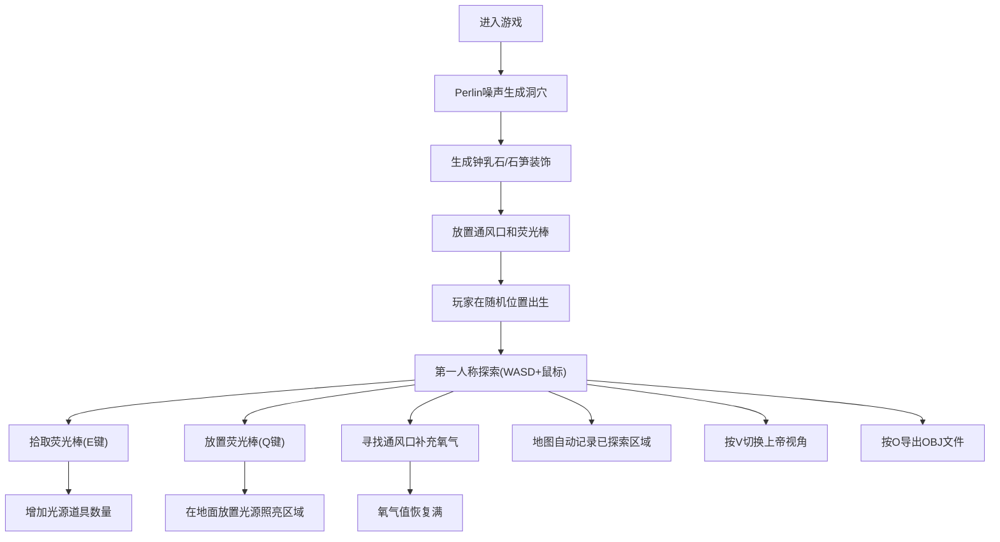

## 1. 产品概述
本产品是一款基于WebGL的3D洞穴探险游戏，玩家在程序化生成的洞穴网络中探索、收集光源、管理氧气并寻找出口。通过Perlin噪声算法生成无限变化的洞穴地形，提供沉浸式的第一人称探险体验。

- **核心目标**：创造独特的洞穴探险体验，每次游戏都有不同的洞穴结构
- **目标用户**：喜欢探索类游戏、对3D技术感兴趣的玩家
- **市场价值**：展示WebGL技术在程序化生成和3D交互方面的潜力

## 2. 核心功能

### 2.1 用户角色
| 角色 | 注册方式 | 核心权限 |
|------|----------|----------|
| 玩家 | 无需注册，直接进入游戏 | 探索洞穴、使用道具、导出地形 |

### 2.2 功能模块
1. **主游戏场景**：3D洞穴渲染、第一人称控制、实时渲染
2. **地形生成系统**：Perlin噪声3D洞穴生成、装饰生成
3. **道具系统**：荧光棒拾取与放置、光源管理
4. **玩家状态系统**：氧气管理、位置追踪、地图探索进度
5. **UI系统**：指南针、矿工地图、氧气条、操作提示
6. **视角系统**：第一人称/上帝视角切换
7. **导出系统**：地形网格OBJ格式导出

### 2.3 页面详情
| 页面名称 | 模块名称 | 功能描述 |
|---------|----------|----------|
| 游戏主界面 | 3D渲染区 | 全屏3D洞穴场景渲染，支持鼠标锁定视角控制 |
| 游戏主界面 | HUD界面 | 显示氧气值、指南针、已探索地图缩略图、操作提示 |
| 游戏主界面 | 道具栏 | 显示当前持有的荧光棒数量 |
| 游戏主界面 | 视角切换按钮 | 一键切换第一人称/上帝视角 |
| 游戏主界面 | 导出按钮 | 将当前洞穴地形导出为OBJ文件 |

## 3. 核心流程
玩家进入游戏后，自动生成随机洞穴，从随机位置开始探索。使用WASD移动、鼠标控制视角，在洞穴中寻找荧光棒和通风口，管理氧气资源，同时地图会记录已探索区域。玩家可以随时切换上帝视角观察整个洞穴结构，或导出当前地形。

## 4. 用户界面设计

### 4.1 设计风格
- **主色调**：深岩灰色(#1a1a2e)、暗蓝色(#16213e)、荧光绿(#00ff88)作为光源色、橙色(#ff6b35)作为氧气警告色
- **字体**：使用 'Space Mono' 等宽字体，营造科技探险感
- **UI元素**：半透明深色背景、荧光边框、简洁的几何形状
- **整体氛围**：幽暗神秘的地下洞穴感，光源营造强烈明暗对比

### 4.2 页面设计概述
| 页面名称 | 模块名称 | UI元素 |
|---------|----------|--------|
| 游戏主界面 | HUD界面 |  - 左上角：氧气进度条（蓝绿色渐变） - 右上角：指南针（圆形，红色指针指向出生点） - 右下角：矿工地图（半透明方格图，绿色显示已探索区域） - 左下角：荧光棒数量显示 - 底部中央：操作提示文字 |
| 游戏主界面 | 交互按钮 |  - 右下角：V键切换视角提示 - 右下角：O键导出提示 - 屏幕中央：准星（十字线） |
| 游戏主界面 | 视觉效果 |  - 屏幕边缘暗角效果 - 光源产生的光晕效果 - 氧气不足时屏幕边缘红色闪烁 |

### 4.3 响应式设计
- **桌面端优先**：针对PC浏览器优化，全屏体验最佳
- **自适应布局**：HUD元素根据窗口大小自动调整位置和尺寸
- **最低分辨率**：1024x768

### 4.4 3D场景指导
- **环境氛围**：幽暗的地下洞穴，远处有雾效营造深邃感
- **光照设置**：
  - 环境光：低强度深蓝色，模拟地下微弱光线
  - 玩家头灯：中等强度聚光灯，跟随视角
  - 荧光棒：点光源，绿色荧光
  - 通风口：微弱蓝色光源标记
- **相机设置**：
  - 第一人称：FOV 75度，近裁剪面0.1，远裁剪面500
  - 上帝视角：正交透视，俯视角30度，可环绕观察
- **材质质感**：
  - 洞穴墙壁：粗糙岩石材质，带法线贴图增加细节
  - 钟乳石/石笋：与墙壁同材质，略深色
  - 荧光棒：自发光材质，产生辉光效果
- **后处理效果**：
  - 环境光遮蔽(SSAO)增强空间感
  - 轻微晕染增强洞穴氛围
  - 泛光效果增强光源表现力
- **性能预算**：
  - 洞穴面数控制在5-10万面
  - 光源数量限制在8个以内（动态）
  - 目标帧率：60fps

