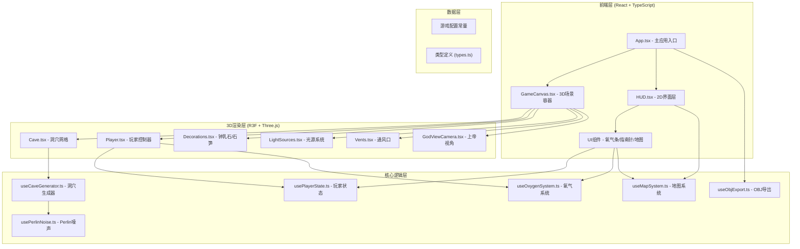

## 1. 架构设计



## 2. 技术描述

### 2.1 技术栈
- **前端框架**：React@18 + TypeScript
- **构建工具**：Vite@5
- **3D渲染**：Three.js + @react-three/fiber + @react-three/drei + @react-three/postprocessing
- **样式方案**：TailwindCSS@3
- **状态管理**：React Hooks (useState, useRef, useContext)

### 2.2 核心依赖说明
| 依赖包 | 版本 | 用途 |
|--------|------|------|
| three | ^0.160.0 | 3D渲染核心库 |
| @react-three/fiber | ^8.15.0 | React Three.js 渲染器 |
| @react-three/drei | ^9.92.0 | 3D组件工具库 |
| @react-three/postprocessing | ^2.15.0 | 后处理效果 |
| three/addons | ^0.160.0 | OBJExporter等工具 |

### 2.3 目录结构
```
src/
├── components/
│   ├── 3d/
│   │   ├── Cave.tsx              # 洞穴网格组件
│   │   ├── Player.tsx            # 第一人称控制器
│   │   ├── Decorations.tsx       # 钟乳石/石笋装饰
│   │   ├── GlowStick.tsx         # 荧光棒组件
│   │   ├── Vent.tsx              # 通风口组件
│   │   └── GodViewCamera.tsx     # 上帝视角相机
│   └── ui/
│       ├── HUD.tsx               # HUD容器
│       ├── OxygenBar.tsx         # 氧气进度条
│       ├── Compass.tsx           # 指南针
│       ├── MiniMap.tsx           # 矿工地图
│       ├── Inventory.tsx         # 道具栏
│       └── ControlsHint.tsx      # 操作提示
├── hooks/
│   ├── usePerlinNoise.ts         # Perlin噪声算法
│   ├── useCaveGenerator.ts       # 洞穴生成逻辑
│   ├── usePlayerState.ts         # 玩家状态管理
│   ├── useOxygenSystem.ts        # 氧气系统
│   ├── useMapSystem.ts           # 地图探索系统
│   ├── useObjExport.ts           # OBJ导出功能
│   └── useKeyboardControls.ts    # 键盘控制
├── types/
│   └── index.ts                  # TypeScript类型定义
├── utils/
│   ├── constants.ts              # 游戏常量配置
│   └── helpers.ts                # 辅助函数
├── context/
│   └── GameContext.tsx           # 游戏状态Context
├── App.tsx                       # 主应用
├── main.tsx                      # 入口文件
└── index.css                     # 全局样式
```

## 3. 核心模块设计

### 3.1 洞穴生成系统
- **算法**：3D Perlin噪声 + Marching Cubes 表面提取
- **参数**：
  - 洞穴尺寸：64x32x64 (x, y, z)
  - 噪声尺度：0.05-0.1
  - 阈值：0.3-0.4（控制洞穴大小）
  - 多频率叠加：3-4层Octaves

### 3.2 第一人称控制器
- **移动**：WASD + 空格跳跃 + Shift加速
- **视角**：PointerLock鼠标控制，限制Y轴旋转(-89°~89°)
- **碰撞检测**：基于距离场的简单碰撞，防止穿墙
- **物理**：简易重力系统

### 3.3 光源系统
- **头灯**：聚光灯(SpotLight)，跟随相机方向，中等强度
- **荧光棒**：点光源(PointLight)，绿色自发光，可拾取/放置
- **光照限制**：最大8个动态光源，超出范围的光源禁用

### 3.4 地图系统
- **数据结构**：二维数组记录每个格子的探索状态
- **更新逻辑**：玩家周围一定半径内的格子标记为已探索
- **渲染**：Canvas 2D渲染迷你地图，实时更新

### 3.5 氧气系统
- **初始值**：100单位
- **消耗速率**：0.5单位/秒
- **补充**：靠近通风口时立即恢复至100
- **警告**：低于30%时屏幕边缘红色闪烁

## 4. 性能优化策略

### 4.1 渲染优化
- **实例化渲染**：钟乳石/石笋使用InstancedMesh
- **视锥裁剪**：Three.js内置，自动剔除不可见物体
- **LOD**：远处洞穴使用简化网格

### 4.2 内存管理
- **资源释放**：组件卸载时释放几何体、材质、纹理
- **对象池**：荧光棒光源复用对象池

### 4.3 后处理
- **选择性启用**：SSAO、Bloom等效果可通过配置开关
- **分辨率缩放**：自动根据性能调整渲染分辨率

## 5. 关键接口定义

```typescript
// 洞穴生成配置
interface CaveConfig {
  size: { x: number; y: number; z: number };
  noiseScale: number;
  threshold: number;
  octaves: number;
  persistence: number;
}

// 玩家状态
interface PlayerState {
  position: THREE.Vector3;
  yaw: number;
  pitch: number;
  velocity: THREE.Vector3;
  oxygen: number;
  glowSticks: number;
  isGodMode: boolean;
}

// 地图格子
interface MapCell {
  explored: boolean;
  hasWall: boolean;
  hasVent: boolean;
  hasGlowStick: boolean;
}

// 荧光棒数据
interface GlowStickData {
  id: string;
  position: THREE.Vector3;
  isPickedUp: boolean;
  intensity: number;
}

// 通风口数据
interface VentData {
  id: string;
  position: THREE.Vector3;
  radius: number;
}
```

